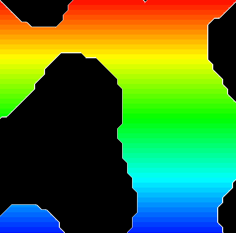
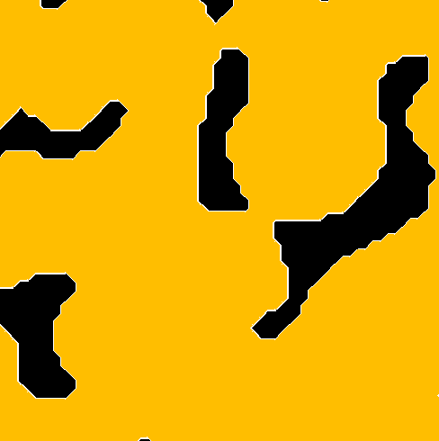
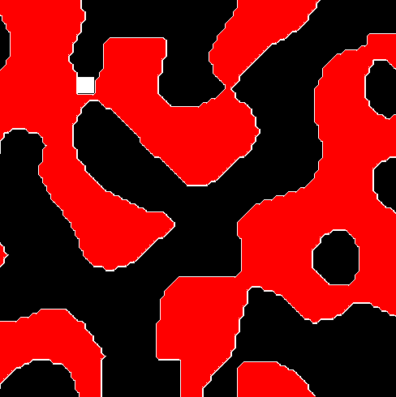

# Marching-Squares

Playing with colors:

Example with even distribution threshold (0.0): 

Example with slightly higher distribution threshold (0.2):

Example with slightly lower distribution threshold (-0.2):

And here's some terrain deformation. I think making a snake-type game out of this might be fun at some point:

Also...I can't help but think of this simulation of quantum fluctuations after staring at these for a while. So here it is:

https://en.wikipedia.org/wiki/Quantum_fluctuation
