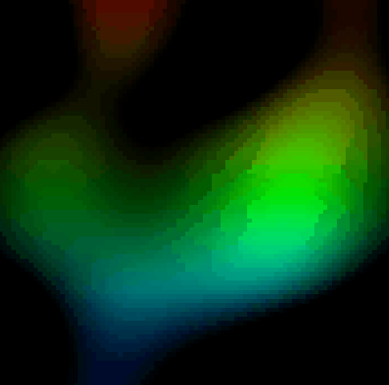
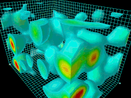

# Marching-Squares

Playing with colors:

Here's a version with weighted colors based on the average of each cell's corners:

And here's some terrain deformation. I think making a snake-type game out of this might be fun at some point:

Also...I can't help but think of this simulation of quantum fluctuations after staring at these for a while. So here it is (I didn't make it):

*puts on "reality is a simulation" hat*

https://en.wikipedia.org/wiki/Quantum_fluctuation
